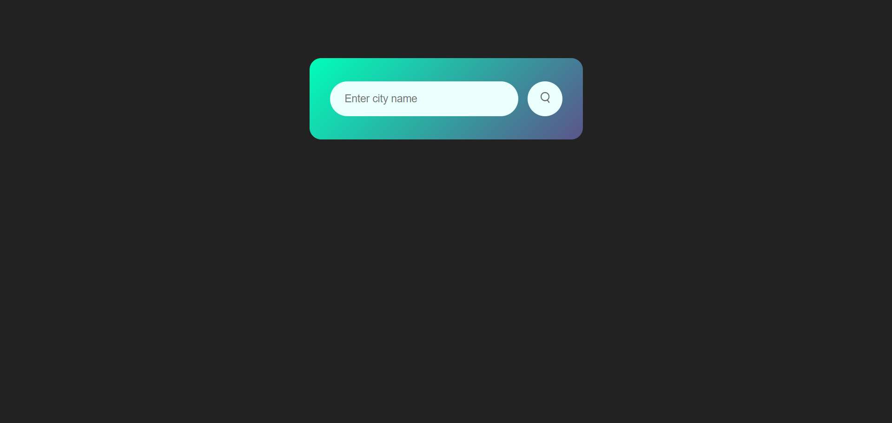
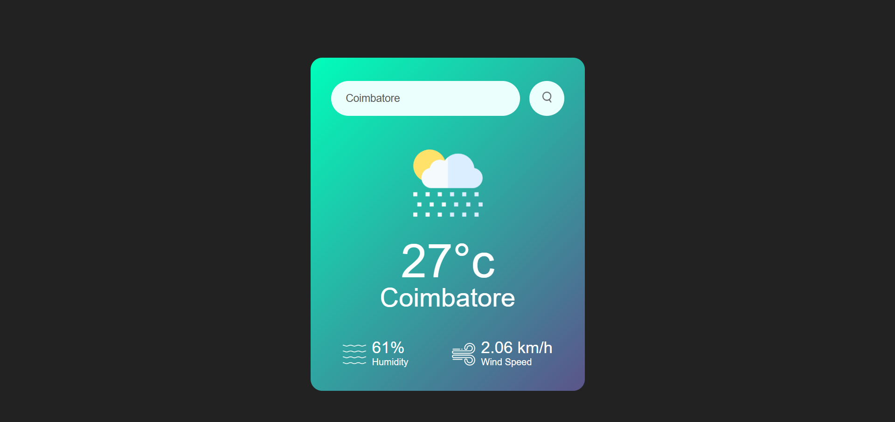

# City-Weather-Checker
City Weather Checker is a simple web application that allows users to check the current weather conditions of any city worldwide. By entering the name of a city, the app fetches the weather data from the OpenWeatherMap API and displays it in an easy-to-read format.

Features:
1. Real-time Weather Information: Displays temperature, humidity, and wind speed for a given city.
2. Dynamic Weather Icons: Shows different weather icons based on the weather condition (e.g., sunny, rainy, cloudy).
3. Error Handling: In case of an invalid city name, the app displays an error message.
4. Responsive Design: The app is designed to be user-friendly and responsive across different devices.

Tech Stack:
1. HTML5 for the basic structure of the webpage.
2. CSS3 for styling and layout.
3. JavaScript for handling API requests and dynamic content updates.
4. OpenWeatherMap API for fetching weather data.

How It Works:
1. Users enter a city name in the search bar.
2. The app sends a request to the OpenWeatherMap API with the provided city name.
3. The weather information (temperature, humidity, and wind speed) is fetched and displayed on the webpage.
4. The app also displays a corresponding weather icon based on the current weather condition.

Installation:
To run this project locally, follow these steps:

1. Clone the repository:

git clone https://github.com/Sowmya-Nagendran/City-Weather-Checker.git

2. Open the project directory:

cd City-Weather-Checker

3. Open index.html in your preferred browser to view the project.

Screenshots:

